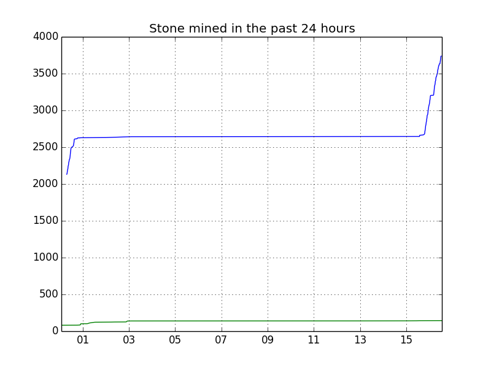

mcscoreboard-miner + postgresql
===============================

First of all import postgresql.schema into your postgresql database. Then modify sample.config (from the contrib/postgres directory) to your likes. Then simply run mcscoreboard-miner like this:
```
$ ./mcscoreboard-miner -c sample.config
```
Afterwards you can create a graph using graph.py (still a work in progress), this requires matplotlib to be installed.

